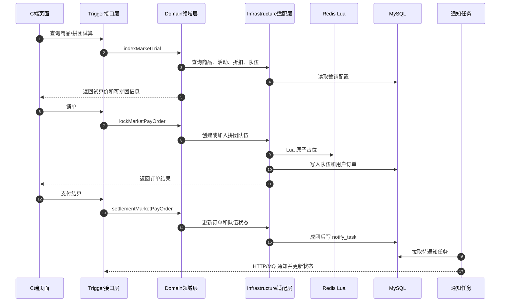

# group-buy-market-yizhou

一个面向互联网 C 端的用户增长中台，借鉴主流电商拼团模式，包含拼团营销与支付商城两大微服务，覆盖优惠试算、拼团组队、锁单结算、成团通知全流程；可对接电商、外卖、出行等多类业务前台。

## 项目亮点

- **DDD 分层落地**：`trigger` 负责入口，`domain` 承载业务编排，`infrastructure` 适配 MySQL/Redis/MQ/HTTP，`api` 定义外部契约。
- **完整拼团链路**：支持商品列表、拼团试算、已有队伍占位、新队伍创建、支付结算、成团通知。
- **高并发占位保护**：已有队伍锁单引入 Redis Lua，实现座位占用的原子校验、幂等占位和失败补偿。
- **可靠通知闭环**：结算后落库 `notify_task`，HTTP/MQ 通知成功后更新状态；失败任务进入重试路径，避免“队列成功但数据库未成功”的假成功。
- **后台运营能力**：商品管理、活动管理、订单管理、用户订单查询、异常订单修复等能力已接入静态 UI。

## 技术栈

- Java 8
- Spring Boot 2.7.12
- MyBatis
- MySQL
- Redis / Redisson
- Maven 多模块
- JUnit 5 / Mockito
- HTML / CSS / JavaScript 静态前端

## 模块说明

| 模块 | 职责 |
|---|---|
| `group-buy-market-yizhou-api` | 对外接口和 DTO 契约 |
| `group-buy-market-yizhou-trigger` | HTTP Controller、定时任务、测试回调入口 |
| `group-buy-market-yizhou-domain` | 拼团试算、锁单、结算、后台商品管理等领域服务 |
| `group-buy-market-yizhou-infrastructure` | MySQL、Redis、HTTP 回调、Lua 脚本和仓储适配 |
| `group-buy-market-yizhou-types` | 通用响应码、异常、责任链/规则树模板 |
| `group-buy-market-yizhou-app` | Spring Boot 启动、配置装配、静态资源映射 |

## 核心业务流程



更详细的链路图见 [docs/upgrade/phase-1-sequence-trial-lock-settlement-notify.md](docs/upgrade/phase-1-sequence-trial-lock-settlement-notify.md)。

## 主要接口

### C 端

| 方法 | 路径 | 说明 |
|---|---|---|
| `GET` | `/api/v1/gbm/index/query_market_product_list` | 查询首页商品列表 |
| `POST` | `/api/v1/gbm/index/query_group_buy_market_config` | 查询商品拼团试算信息 |
| `POST` | `/api/v1/gbm/trade/lock_market_pay_order` | 锁定拼团订单 |
| `POST` | `/api/v1/gbm/trade/settlement_market_pay_order` | 支付结算 |
| `POST` | `/api/v1/gbm/trade/cancel_market_pay_order` | 取消未支付订单 |

### 后台

| 方法 | 路径 | 说明 |
|---|---|---|
| `GET` | `/api/v1/gbm/admin/products` | 商品列表 |
| `POST` | `/api/v1/gbm/admin/products` | 新增商品 |
| `PUT` | `/api/v1/gbm/admin/products/{goodsId}` | 修改商品 |
| `DELETE` | `/api/v1/gbm/admin/products/{goodsId}` | 删除商品 |
| `POST` | `/api/v1/gbm/admin/products/initialize-default` | 初始化默认商品 |
| `GET` | `/api/v1/gbm/admin/marketing/activities` | 活动列表 |
| `POST` | `/api/v1/gbm/admin/marketing/activities` | 新增活动 |
| `PUT` | `/api/v1/gbm/admin/marketing/activities/{activityId}/status` | 活动状态流转 |
| `GET` | `/api/v1/gbm/admin/orders` | 订单列表 |
| `DELETE` | `/api/v1/gbm/admin/orders/{outTradeNo}` | 取消待支付订单 |

## 本地启动

### 1. 准备依赖

默认开发配置位于 `group-buy-market-yizhou-app/src/main/resources/application-dev.yml`：

- MySQL: `127.0.0.1:13306`
- Redis: `127.0.0.1:16379`
- 后端端口: `8091`

SQL 初始化脚本可参考：

- `docs/dev-ops/mysql/sql/2-15-group_buy_market.sql`

### 2. 编译和测试

```bash
mvn -q -DskipTests compile
mvn -q test
```

### 3. 启动后端

```bash
mvn -pl group-buy-market-yizhou-app -am install -DskipTests
mvn -pl group-buy-market-yizhou-app spring-boot:run
```

启动后可以访问：

- C 端页面：`http://127.0.0.1:8091/index.html`
- 登录页：`http://127.0.0.1:8091/login.html`
- 后台页面：`http://127.0.0.1:8091/admin.html`

从旧数据库升级时，先执行一次 `docs/dev-ops/mysql/sql/2-16-add-sku-stock.sql`，为商品表补齐库存字段。使用项目 Docker MySQL 时可直接执行：

```bash
docker exec -i mysql mysql -uroot -p123456 group_buy_market < docs/dev-ops/mysql/sql/2-16-add-sku-stock.sql
```

业务访问统一使用 `8091`，同一次登录不要混用 `localhost` 和 `127.0.0.1`。`8088` 仅用于不依赖登录态和后端接口的静态页面预览：

```bash
cd docs/ui/html
python3 -m http.server 8088
```

## 测试覆盖重点

当前测试重点覆盖了：

- 结算通知任务不把 MQ 入队误判为最终成功。
- MQ 消费成功后正确更新 `notify_task` 状态，更新失败时进入重试。
- 后台商品参数校验，避免非法数据写库。
- 后台商品创建/更新/删除/查询/初始化通过领域服务委托，不让 controller 直连商品 DAO。
- 后台订单删除走交易领域取消逻辑，不做物理删除。
- 活动新增不再覆盖旧活动，避免影响已绑定商品或历史订单。
- C 端商品列表使用公开接口，不依赖后台管理接口。

## 已完成的关键修复

- 修复结算通知的状态语义：`QUEUED` 不再被当作 `SUCCESS`。
- 修复 MQ 通知消费的数据库状态更新和失败回退。
- 修复后台订单删除绕过领域服务的问题。
- 修复商品管理直接写 DAO、混杂活动映射逻辑的问题，抽出 `IAdminProductService`。
- 修复活动查询的隐藏写库副作用。
- 修复新增活动覆盖同类型旧活动的问题。
- 补齐商品新增/修改的参数校验和测试。
- 增加 C 端商品列表接口，前台不再调用后台管理 API。

## 架构演进文档

- [模块边界](docs/upgrade/phase-1-module-mapping.md)
- [API 归属](docs/upgrade/phase-1-api-ownership.md)
- [表归属](docs/upgrade/phase-1-table-ownership.md)
- [核心链路时序图](docs/upgrade/phase-1-sequence-trial-lock-settlement-notify.md)
- [UI 改造记录](docs/upgrade/ui-v2-phase-1.md)
