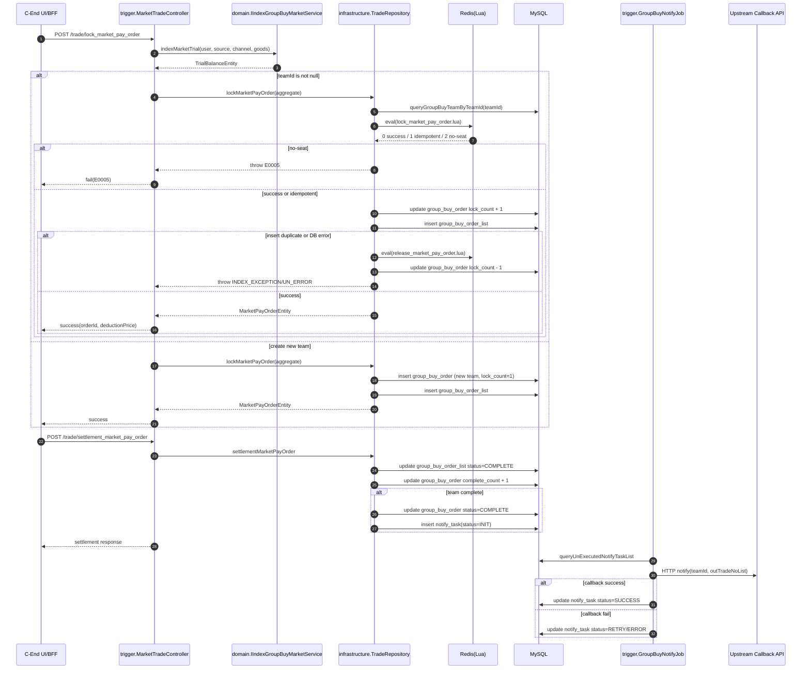

# Phase 1 - Sequence Diagram (`trial -> lock -> settlement -> notify`)

## Notes

- `lock_market_pay_order` HTTP contract remains unchanged in this phase.
- Lua is currently used for existing team occupancy only (`teamId != null`).
- DB remains the final source of truth; Redis is used as high-concurrency guard + idempotent fast path.
- If Lua succeeds but DB write fails, compensation path releases Redis occupancy immediately.

